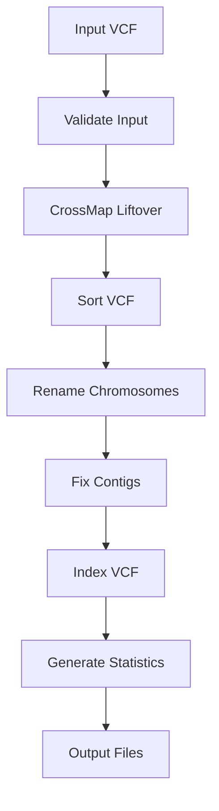

# Liftover Methods ​

Detailed explanation of coordinate conversion methods, CrossMap integration, and the technical aspects of genome build liftover.

## Overview ​

chiptimptation-vcf-liftover uses CrossMap to convert genomic coordinates between reference genome builds. This process, called "liftover," translates variant positions from one genome assembly to another while maintaining biological accuracy.

## CrossMap Integration ​

### What is CrossMap? ​

CrossMap is a versatile tool for converting genomic coordinates between different reference genomes. It uses chain files that describe the alignment between genome assemblies.

**Key features:**
- High-accuracy coordinate conversion
- Support for multiple file formats (VCF, BED, GFF, etc.)
- Robust handling of complex genomic regions
- Comprehensive error reporting

### Chain Files ​

Chain files describe the alignment between two genome assemblies:

```
chain 4900 chr1 249250621 + 0 249250621 chr1 248956422 + 0 248956422 2
13970 0 0
71 1 0
139 0 1
...
```

**Chain file components:**
- **Score**: Alignment quality score
- **Source/Target**: Chromosome information
- **Coordinates**: Start and end positions
- **Alignment blocks**: Detailed mapping information

### Supported Conversions ​

#### Primary Conversions ​
- **hg19 → hg38**: Most common conversion (default)
- **hg38 → hg19**: Reverse conversion
- **GRCh37 → GRCh38**: Equivalent to hg19 → hg38
- **Custom**: User-provided chain files

#### Chain File Sources ​
- **UCSC Genome Browser**: Primary source for standard conversions
- **Ensembl**: Alternative chain files
- **Custom**: User-generated alignments

## Liftover Process ​

### Step-by-Step Workflow ​

#### 1. Input Validation ​
```bash
# Validate VCF format
bcftools view -h input.vcf.gz

# Check chromosome naming
bcftools view input.vcf.gz | cut -f1 | sort | uniq
```

#### 2. Coordinate Conversion ​
```bash
# CrossMap command (internal)
CrossMap.py vcf hg19ToHg38.over.chain.gz \
  input.vcf.gz \
  GRCh38.fa \
  output_lifted.vcf
```

#### 3. Post-Processing ​
- Sort variants by genomic position
- Rename chromosomes to match target
- Create index files
- Generate statistics

### Conversion Accuracy ​

#### High-Confidence Regions ​
- **Success rate**: >99%
- **Characteristics**: Well-mapped, single-copy regions
- **Examples**: Exonic regions, known genes

#### Moderate-Confidence Regions ​
- **Success rate**: 95-99%
- **Characteristics**: Some assembly differences
- **Examples**: Intergenic regions, simple repeats

#### Low-Confidence Regions ​
- **Success rate**: <95%
- **Characteristics**: Complex genomic regions
- **Examples**: Centromeres, heterochromatin, segmental duplications

## Technical Implementation ​

### Pipeline Architecture ​



### Process Details ​

#### CROSSMAP_LIFTOVER ​
```groovy
process CROSSMAP_LIFTOVER {
    input:
    tuple val(meta), path(vcf)
    path(chain_file)
    path(target_fasta)
    
    output:
    tuple val(meta), path("*.vcf"), emit: vcf
    path("*.log"), emit: log
    
    script:
    """
    CrossMap.py vcf ${chain_file} ${vcf} ${target_fasta} ${meta.id}_lifted.vcf
    """
}
```

#### SORT_VCF ​
```groovy
process SORT_VCF {
    input:
    tuple val(meta), path(vcf)
    
    output:
    tuple val(meta), path("*.vcf.gz"), emit: vcf
    
    script:
    """
    bcftools sort ${vcf} -Oz -o ${meta.id}_sorted.vcf.gz
    """
}
```

### Error Handling ​

#### Conversion Failures ​

**No target region:**
- Variant position not in chain file
- Sequence absent in target genome
- Assembly-specific insertions

**Multiple mappings:**
- Ambiguous coordinate conversion
- Repetitive sequence regions
- Paralogous sequences

**Chain gaps:**
- Alignment discontinuities
- Structural variations
- Assembly artifacts

#### Recovery Strategies ​

1. **Retry with relaxed parameters**
2. **Manual coordinate lookup**
3. **Alternative chain files**
4. **Exclusion from analysis**

## Configuration Options ​

### Basic Parameters ​

```bash
# Source and target genome builds
--source_build hg19
--target_build hg38

# Chain file specification
--chain_file /path/to/custom.chain.gz
--chain_url https://example.com/chain.gz
```

### Advanced Options ​

```bash
# Validation settings
--validate_output true
--min_match_ratio 0.95

# Processing options
--sort_vcf true
--rename_chromosomes true
--fix_contigs true
--index_vcf true
```

### Performance Tuning ​

```bash
# Resource allocation
--crossmap_cpus 4
--crossmap_memory '16.GB'

# Parallel processing
--max_cpus 16
--max_memory '64.GB'
```

## Quality Assessment ​

### Success Metrics ​

#### Overall Success Rate ​
```
Total variants: 1,000,000
Successfully lifted: 970,000
Success rate: 97.0%
```

#### Chromosome-Specific Rates ​
```
chr1: 98.5% (120,000/122,000)
chr2: 97.8% (110,000/112,500)
chrX: 95.2% (45,000/47,300)
chrY: 92.1% (8,500/9,200)
```

### Quality Indicators ​

#### Excellent Quality (>98%) ​
- High-coverage genomic regions
- Standard chromosome naming
- Recent, high-quality assemblies

#### Good Quality (95-98%) ​
- Typical for most datasets
- Some complex regions
- Standard processing acceptable

#### Concerning Quality (<95%) ​
- Review input data quality
- Check genome build compatibility
- Consider manual validation

## Best Practices ​

### Input Preparation ​

1. **Verify genome build** of input data
2. **Standardize chromosome naming** (chr1, chr2, etc.)
3. **Validate VCF format** before processing
4. **Check for coordinate consistency**

### Parameter Selection ​

1. **Use appropriate chain files** for your conversion
2. **Enable validation** for critical analyses
3. **Adjust resources** based on data size
4. **Document parameter choices** for reproducibility

### Result Validation ​

1. **Review success rates** by chromosome
2. **Spot-check critical variants** manually
3. **Compare with known databases** when possible
4. **Validate downstream compatibility**

## Troubleshooting ​

### Low Success Rates ​

#### Check Input Data ​
```bash
# Verify chromosome naming
bcftools view input.vcf.gz | cut -f1 | sort | uniq

# Check coordinate ranges
bcftools query -f '%CHROM\t%POS\n' input.vcf.gz | head
```

#### Verify Chain File ​
```bash
# Check chain file format
head -10 chain_file.chain

# Verify chromosome compatibility
grep "^chain" chain_file.chain | cut -f3,8
```

### Conversion Errors ​

#### CrossMap Failures ​
```bash
# Check CrossMap logs
cat work/*/crossmap.log

# Test CrossMap manually
CrossMap.py vcf chain.gz input.vcf ref.fa output.vcf
```

#### Memory Issues ​
```bash
# Increase memory allocation
--crossmap_memory '32.GB'

# Split large files
bcftools view -r chr1 input.vcf.gz > chr1.vcf
```

## Advanced Topics ​

### Custom Chain Files ​

#### Creating Chain Files ​
```bash
# Using LASTZ alignment
lastz source.fa target.fa --format=axt > alignment.axt
axtChain alignment.axt source.2bit target.2bit output.chain
```

#### Validating Chain Files ​
```bash
# Check chain file integrity
chainCheck chain_file.chain

# Verify coverage
chainStats chain_file.chain
```

### Alternative Methods ​

#### LiftOver (UCSC) ​
- Web-based interface
- Limited to small datasets
- Good for manual validation

#### Ensembl Assembly Converter ​
- REST API access
- Alternative chain files
- Different coordinate systems

#### Custom Scripts ​
- Specialized conversions
- Non-standard assemblies
- Research applications

## Related Resources ​

- [Understanding Results](/docs/understanding-results) - Interpreting liftover output
- [Quality Control](/docs/quality-control) - Comprehensive validation procedures
- [Parameters](/reference/parameters) - Complete parameter reference
- [Troubleshooting](/docs/troubleshooting) - Solving conversion issues
